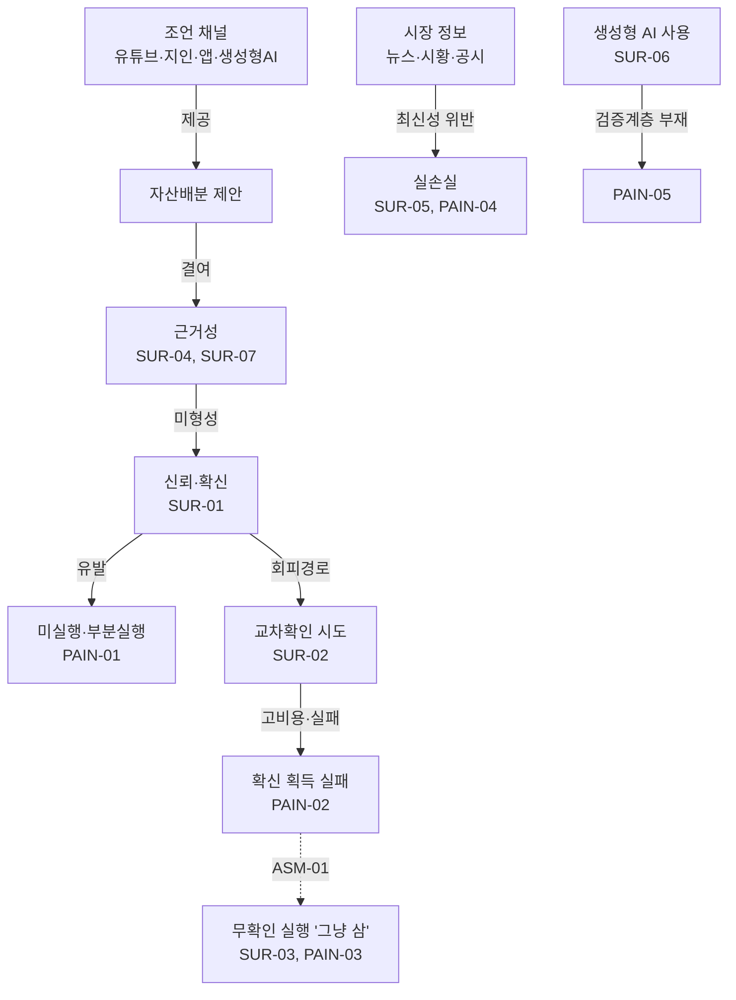

# 온톨로지 v1 — 포트폴리오 설명 챗봇 도메인

> 버전: v1 (2026-09-30) · 근거: 설문조사 10건(2026-09-16 ~ 09-30) + 팀 프로젝트 정의
> 상위 문서: 없음 · 하위 문서: `problem-definition.md`, `spec-v1.md`

## 0. 근거 태그 체계

이 저장소의 모든 문서는 주장마다 아래 태그로 근거 등급을 표기한다.

| 태그 | 의미 | 지위 |
|---|---|---|
| `[SUR-N]` | 설문조사에서 직접 확인된 사실 | 검증됨 (n=10 한계 내) |
| `[ASM-N]` | 팀이 설정한 가정 | **미검증 — 인터뷰 검증 대상** |
| `[PRJ]` | 프로젝트 정의(팀 합의)에서 온 설계 결정 | 합의됨 |

### 증거 색인 (SUR)

| ID | 내용 | 출처 응답 |
|---|---|---|
| SUR-01 | 자산배분 조언 수신자 4명 중 3명이 신뢰·확신 부재로 전부 실행하지 않음 — "믿음직스럽지 않아서", "지인 의견에 모두 동의할 수 없어서", "확신이 들지 않았기 때문" | R1, R3, R10 |
| SUR-02 | 제안 검증에 드는 확신 획득 비용이 높음 — 2시간(R1), 며칠(R3), 결국 확신 못 얻음(R6) | R1, R3, R6, R9 |
| SUR-03 | 매수·매도 결정 직전 30분 행동이 "그냥 샀다" 6/10 | R1,2,5,7,8 + R6 |
| SUR-04 | 투자 정보 출처에서 유튜브(4)·커뮤니티(2)가 공식 출처(리포트 1, 공시 1)를 압도 | Q10 집계 |
| SUR-05 | 낡은/부정확 정보 기반 투자 판단 실손실 사례 — "클래리티 법안 통과 여부를 보고 이더리움 숏" | R1 |
| SUR-06 | 생성형 AI를 이미 금융 정보 채널로 사용 4/10 — 자산배분 논의, 시황 확인 루틴, 제도 자격 확인, 정보 탐색 경로 | R6, R7, R8, R10 |
| SUR-07 | 금융앱 추천 포트폴리오를 그대로 실행한 경험 0/10 — "거짓같아서" | Q8 집계, R2 |
| SUR-08 | 자산관리·투자 정보에 대한 유료 지불 경험 0/10 (전 도메인) | Q7, Q16 집계 |
| SUR-09 | 보유 자산 관련 뉴스·시황 확인 루틴 없음 6/10 | Q14 집계 |

### 가정 색인 (ASM) — 인터뷰 검증 백로그

| ID | 가정 | 검증 방법 |
|---|---|---|
| ASM-01 | "그냥 샀다"(SUR-03)는 확인 필요성을 못 느껴서가 아니라, 확인 비용이 높아 학습된 포기다 | 인터뷰: 해당 응답자 유형에게 "왜 확인하지 않았나" 심층 질문 |
| ASM-02 | 추천 비중에 출처가 연결된 설명이 붙으면 실행 확신이 상승한다 | 프로토타입 A/B 또는 인터뷰 반응 테스트 |
| ASM-03 | 생성형 AI 답변(SUR-06)에 대해 사용자는 사실성 검증 수단을 원한다 | 인터뷰: GPT 사용자 4명 유형 집중 섭외 |
| ASM-04 | 뉴스·시황과 비중을 연결한 설명이 "왜 이 비중인가"에 대한 이해를 높인다 | 사용성 테스트 |
| ASM-05 | 서비스는 무료 사용을 전제한다 (SUR-08에 근거한 스코프 결정) | — (결정사항) |

---

## 1. 개념 (Entities)

### 1.1 행위자 (Actors)

| 개념 | 정의 | 근거 |
|---|---|---|
| 저관여 개인투자자 | 투자는 하지만 정보 탐색·검증 루틴이 없는 2030 투자자. 설문 주 표본 | SUR-03, SUR-09 |
| 조언 채널 | 자산배분 제안의 공급자: 유튜브, 지인, 금융앱, 생성형 AI | SUR-04, SUR-06, SUR-07 |
| 포트폴리오 최적화기 | 기존 알고리즘. 수치 입력(수익률·공분산 등)으로 투자비중을 산출하는 외부 모듈 | PRJ |
| 시스템 에이전트 | Research / Explanation / Verification 3역 (spec-v1.md, AGENTS.md 참조) | PRJ |

### 1.2 정보 객체 (Information Objects)

| 개념 | 정의 | 핵심 속성 | 근거 |
|---|---|---|---|
| 추천 포트폴리오 | 최적화기가 산출한 자산별 투자비중 벡터 | 산출 기준시점 `t_opt` | PRJ |
| 시장 정보 항목 | 크롤링으로 수집된 뉴스·시황·공시 단위 문서 | 출처 URL, 발행시각 `t_pub`, 수집시각 `t_crawl`, 출처 등급 | PRJ |
| 설명 | 비중과 시장 정보를 연결해 생성된 자연어 응답 | 주장(claim) 목록, 각 주장의 출처 ID | PRJ |
| 주장 (claim) | 설명 내 검증 가능한 최소 사실 단위 | 출처 연결 여부, 수치 포함 여부 | PRJ |
| 검증 판정 | 검증 에이전트가 주장 단위로 내리는 판정 | 통과 / 반려 / 경고 라벨 | PRJ |

### 1.3 행위 (Actions)

| 개념 | 정의 | 근거 |
|---|---|---|
| 조언 수신 | 채널로부터 자산배분 제안을 받음 (4/10) | Q1 집계 |
| 미실행·부분실행 | 제안을 받고도 실행하지 않거나 일부만 실행 | SUR-01 |
| 무확인 실행 ("그냥 삼") | 검증 없이 매수·매도 | SUR-03 |
| 교차확인 | 다른 출처·지인·백테스트로 제안을 검증하려는 시도 | SUR-02 |
| 확신 획득 실패 | 교차확인에도 결론에 도달하지 못함 | SUR-02 (R6) |

### 1.4 판단 속성 (Judgement Criteria)

| 개념 | 정의 | 근거 |
|---|---|---|
| 신뢰 (trust) | 제안·정보의 진실성에 대한 사용자의 믿음. 부재 시 미실행 유발 | SUR-01, SUR-07 |
| 확신 (confidence) | 실행 결정을 내리기에 충분한 심리적 상태. 획득 비용이 높음 | SUR-02 |
| 최신성 (recency) | 정보가 현재 시점에 유효한지. 위반 시 실손실 | SUR-05 |
| 근거성 (groundedness) | 주장이 확인 가능한 출처에 연결되는지. 현재 채널 대부분 결여 | SUR-04, ASM-03 |

### 1.5 페인포인트 (Pain Points)

| ID | 페인포인트 | 근거 |
|---|---|---|
| PAIN-01 | 제안의 근거를 확인할 수 없어 신뢰·확신이 형성되지 않고, 실행이 보류됨 | SUR-01, SUR-07 |
| PAIN-02 | 스스로 검증하려면 비용이 크고(수 시간~며칠), 실패하기도 함 | SUR-02 |
| PAIN-03 | 검증 비용 회피의 결과로 무확인 실행이 지배적 행동이 됨 | SUR-03 + **ASM-01** |
| PAIN-04 | 낡은 정보를 최신으로 오인해 판단하면 실손실이 발생 | SUR-05 |
| PAIN-05 | 이미 사용 중인 생성형 AI 채널에는 사실성 검증 계층이 없음 | SUR-06 + **ASM-03** |

## 2. 관계 (Relations)

읽는 법: 실선은 설문에서 확인된 연결, 점선(`ASM-01`)은 팀 가정으로만 연결된 구간이다. **이 온톨로지에서 유일하게 점선인 G→H 구간이 인터뷰 최우선 검증 대상이다.**

## 3. 시스템 대응 관계 (온톨로지 → 솔루션 컴포넌트)

| 페인포인트 / 속성 | 대응 컴포넌트 | 스펙 참조 |
|---|---|---|
| 최신성 (PAIN-04) | Research Agent — 실시간 크롤링 + 시점 메타데이터 | FR-02 |
| 근거성 (PAIN-01) | Explanation Agent — 비중↔시장정보 연결 설명, 전 주장 출처 첨부 | FR-03 |
| 신뢰 (PAIN-05, SUR-05) | Verification Agent — 주장-출처 대조, 무근거 주장 차단 | FR-04 |
| 확신 비용 (PAIN-02) | 시스템 전체 — 수 시간짜리 교차확인을 대화 1회로 압축 | NFR-01 |

## 4. v1의 한계 (명시)

- 표본 n=10, 저관여층 편중, 전문가급 이상치 1명(R1) 포함 — 빈도 수치는 방향성 지표로만 사용한다.
- 분기 문항 로직 오염(비대상자 응답)이 있어 Q2·Q5 계열 집계는 보수적으로 해석했다.
- 페인포인트의 강도(지불의사)는 확인되지 않았다(SUR-08). 본 프로젝트는 이를 무료 서비스 전제(ASM-05)로 흡수한다.
